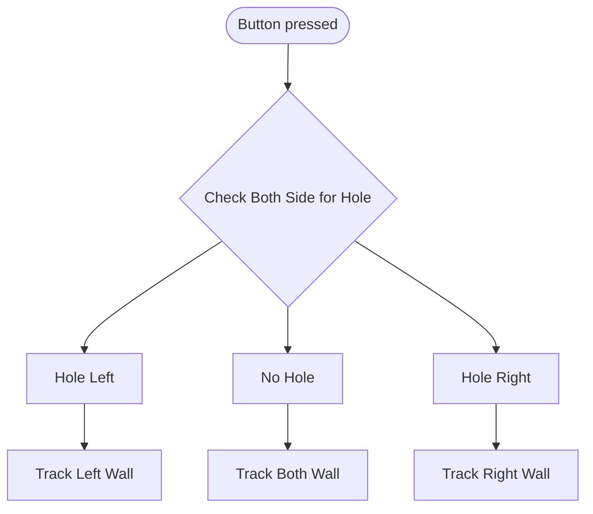

Control software
====

### OPEN CHALLENGE 

For open challenge, our approach to the problems are very simple. This could be changed later if we qualified to international rounds, however for the current national rounds the solutions will be very simple as the inside wall of the gamefield is static. 

Firstly, before the robot needs to do anything it needs to check whether its going clockwise or counter-clockwise. The solution for this problem is to check for the hole before it **reaches** the hole. To do this we had to do some basic trigonometry:

 

We check for holes using a static range in our LiDAR scanner, for example we want to check from 30-60cm in front of us. We would first use the Pythagorean theorem: $a^2 + b^2 = c^2$. We then do this for another hypotenuse as there are 2 range, 30cm and 60cm. Using the two hypotenuse we can find the angle by using: $Tan(θ) = opposite/adjacent$. After finding out this angle we can use it into our code to scan for those specifics angles, and there will be specific ranges we can use to compare to the angle to check whether those laser beams past through our ranges or not. If all of the laser beams divided by 2 passes through our range, then it would be considered a wall. 

Moving on here is a flowchart of how the first part of our open challenge round will be like.

After tracking the walls, we move on to our turning segment of the algorithm. Since we have an IMU that we can fully utilize, we use that IMU to check for every turn and record it until it hits 12, then the robot will stop. We have a set of array that stores the angles in radians for all the 4 turns the robot will commit to during the round. It will loop through the array and compare the real IMU data to this array, and will add 1 turn for everytime the IMU matches the array. 
